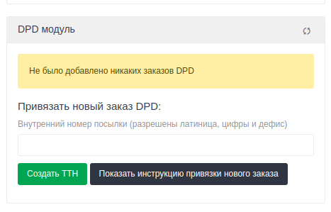

# Реализация работы динамического блока Usedesk для DPD доставки (используя PHP)

## Описание

Скрипт расширяет интерфейс [Usedesk](https://usedesk.ru), позволяя добавить/создать (и следить за их статусом)
товарно-транспортную накладную (**ТТН**) [ТК DPD](https://www.dpd.ru/) для каждого отдельного запроса/**тикета**.

## Использование по умолчанию (оформление возвратной доставки через соответствующую страницу в DPD)

По умолчанию скрипт настроен так, что пользователь только добавляет номер ТТН от DPD на странице тикета в Usedesk. Тем
самым, добавленный ТТН будет прикреплен к тикету, пока пользователь сам не открепит (нажав соответствующую кнопку в том
же блоке). При каждом обновлении страницы или динамического блока будет отображаться актуальный статус доставки (сначала
проверяется статус оформления заказа в DPD, и при успешном статусе проверяется непосредственно статус доставки).

Можно добавить не один ТТН к тикету Usedesk

При первом переходе на страницу тикета в Usedesk в динамическом блоке мы увидим уведомление, что ТТН DPD не добавлен к тикету. Справа снизу есть кнопка по нажатию на которую мы можем прочесть инструкцию.

#### Если заказ еще не создан
1. Заполните поле "**Внутренний номер посылки**" (будет использоваться в DPD)
2. Нажать кнопку "**Создать ТТН**"
3. Система в новой вкладке откроет для вас страницу заполнения формы для оформления возврата. Если будет предупреждение от вашего браузера на незащищенный переход - согласитесь
4. Заполните форму оформления возврата
5. Все готово! После успешного заполнения формы DPD: либо заново откройте эту страницу (на которой читаете эту инструкцию), либо (если не закрыли случайно эту страницу) нажмите на появившуюся кнопку "**Обновить статус**" (появляется после нажатия кнопки "**Создать ТТН**")

#### Заказ в DPD уже создан и у вас есть внутренний № заказа
1. Заполните поле "**Внутренний номер посылки**"
2. Нажать кнопку "**Создать ТТН**"
3. Система в новой вкладке откроет для вас страницу заполнения формы для оформления возврата. Если будет предупреждение от вашего браузера на незащищенный переход - согласитесь
4. В открывшейся странице DPD ничего не заполняйте, уже все готово! Либо заново откройте эту страницу (на которой читаете эту инструкцию), либо (если не закрыли случайно эту страницу) нажмите на появившуюся кнопку "**Обновить статус**" (появляется после нажатия кнопки "**Создать ТТН**")

#### Заказ в DPD уже создан и у вас есть только номер ТТН
1. Чтобы получить "**Внутренний номер посылки**" к ТТН, который у вас уже есть - перейдите по ссылке https://www.dpd.ru/ols/trace2/standard.do2
2. В поле "**Номер отправки**" введите номер полученного ТТН и нажмите стрелочку справа для получения информации об отправке
3. Из полученной таблицы скопируйте значение поля "**Номер заказа Клиента**"
4. Вернитесь на страницу заявки в Usedesk (страницу, на которой читаете эту инструкцию сейчас).
5. Вставьте скопированное в поле "**Внутренний номер посылки**"
6. Нажать кнопку "**Создать ТТН**"
7. Система в новой вкладке откроет для вас страницу заполнения формы для оформления возврата. Если будет предупреждение от вашего браузера на незащищенный переход - согласитесь
8. В открывшейся странице DPD ничего не заполняйте, уже все готово! Либо заново откройте эту страницу (на которой читаете эту инструкцию), либо (если не закрыли случайно эту страницу) нажмите на появившуюся кнопку "**Обновить статус**" (появляется после нажатия кнопки "**Создать ТТН**")

## Использование c созданием обычной доставки DPD (собственная форма по созданию заказа доставки)

Пользователь на странице тикета в Usedesk через динамический блок переходит на страницу создания заказа. После создания
на странице тикета в динамическом блоке будет отображен статус доставки от компании DPD

Пользователь взаимодействует с работой этого проекта в 3 местах:

- [Динамический блок на странице тикета Usedesk](#header_dynamic)
- [Страница создания ТТН](#header_create_ttn_page)
- [Обновление списка городов от DPD](#header_update_cities)

#### Динамический блок на странице тикета Usedesk <a id="header_dynamic" />

На странице каждого тикета на сайте Usedesk справа в динамическом блоке отображается:

- **Случай, если еще не создавали ТТН для этого тикета из интерфейса:**

  Кнопка, ведущая на [страницу оформления ТТН](#header_create_ttn_page) для DPD

- **Если уже создана ТТН, осуществив оформление в предыдущем пункте:**

  Отображение актуального статуса оформления ТТН или содержимое из прошлого пункта (если заказ был отменен DPD по
  каким-либо причинам)

При открытии страницы тикета - запрос успевает отсылаться сразу на DPD, и вернуть статус заказа для перепроверки на
всякий случай. Т.е. пользователь видит актуальную информацию. Выходит, что пользователь либо увидит зеленый блок с
номером ТТН, либо желтый с уведомлением о внутренней доработке
заказа DPD (может быть, если введенный адрес не был одобрен системой DPD автоматически)

У пользователя есть возможность отвязать ТТН от тикета в интерфейсе Usedesk, перейдя по красной кнопке внизу "Отвязать
созданную ТТН". После перехода по кнопке, обновив страницу тикета пользователь увидит прошлый вариант блока с
возможностью оформления ТТН – буд-то ТТН и не создавали ранее для тикета.

#### Страница создания ТТН <a id="header_create_ttn_page" />

От пользователя требуется заполнить все необходимые поля (помечены звездочке в начале заголовка).

**Особенности:**

- Некоторые поля предзаполнены - можно изменить содержимое.
- При заполнении поля "Населенный пункт" ниже высветится список с подходящими к введенному запросу населенными пунктами.
  Пользователю необходимо будет кликнуть на подходящий ему выбор из списка (сделано для того, чтобы пользователь с
  меньшей вероятностью совершил ошибку в названии населенного пункта, его типа и названии региона)
- После заполнения всех полей пользователю следует нажать на кнопку внизу "Отправить". После чего он увидит ответ от DPD
    - 3 возможных варианта:
        - Успешное получение ТТН с выводом номера
        - Заказ на доработке DPD (если адрес автоматически ими не одобрен)
        - Произошла ошибка с выводом этой ошибки. Например, была введена несуществующая улица

      Первые 2 случая заносятся в базу. И при следующем посещении страницы тикета Usedesk - в соответствующем блоке
      будет отображаться актуальная информация о статусе ТТН. В последнем случае - пользователь может совершить
      оформление заново: либо обновив страницу, либо заново перейдя по кнопке оформления заказа из страницы тикета
      Usedesk.

#### Обновление списка городов от DPD <a id="header_update_cities" />

Использование этой возможности имеет смысл только в том случае, если выбран [режим поиска городов](#search_mode)
последний (использование актуального списка населенных пунктов с возможностью доставки курьером от DPD)

Переход по следующей ссылке произведет обновление автоматически и выведет на экран `Обновление успешно` при успешном
завершении.

`http://your.domain/dpd-update-city-list.php` - т.е. такой же адрес как и у основного выполняющегося
файла `usedesk-dpd.php`. Отличается лишь название файла.

На вышеуказанный адресс можно повесить CRON-задачу, либо на свое усмотрение раз в какой-то период перейти по ссылке -
больше ничего. На сервере обновятся или создадутся (если впервые запущен) файлы, где хранится актуальный вышеупомянутый
список.

## Установка/Настройка скрипта

### Установка на сервер

1. Выполняем `git clone https://github.com/ionov-e/usedesk-dpd.git .` в соответствующей созданной папке для проекта на
   своем хостинге/сервере
2. В настройках Nginx/Apache в файле конфигурации проекта указываем папку **public** как root. Например, для nginx
   строка вида: `root /var/www/your_folder/public;` (вместо пути "/var/www/your_folder/" - указываете собственный к
   проекту).
3. Зайти в папку с файлами и выполнить `composer update`
4. Перейти к следующему разделу - [создание файла **.env**](#header_env_file)
5. При желании можно сделать копию файла `index.php.example` в папке **public** и переименовать копию
   в `index.php` <a id="index_file" />. Тогда
   в [URL при настройках блока Usedesk](#usedesk_url) достаточно будет ввести
   домен или путь к папке содержащую `index.php`

### Создание/редактирование файла окружения .env <a id="header_env_file" />

В содержимом репозитория есть файл **.env.example** - делаем его копию (в той же папке) с названием **.env**

Внутри файла **.env**:

- **CLIENT_NUMBER** - клиентский номер в DPD (номер договора, указан вверху-справа в личном кабинете DPD)
- **CLIENT_KEY** - уникальный ключ авторизации, полученный у сотрудника DPD. В примере (**.env.example**) для первых
  двух значений введены данные для доступа к тестовому аккаунту от DPD
- **URL_SCRIPT_DOMAIN** - URL-адрес откуда будут доступны вложенные в скрипт файлы (без '/' на конце)
- **RETURN_ORDER_MODE** - Режим заказа в DPD обратной доставки (1) или обычной доставки (0)
- **URL_DPD_DOMAIN** - Сервер DPD. Первый - тестовый, второй - рабочий. Один закомментировать. Используется при создании
  ТТН, получении статусов и обновлении списка городов от DPD
- **CITY_LIST_SEARCH_MODE** <a id="search_mode" /> - **(используется только при обычной доставки - RETURN_ORDER_MODE=0)** - 3 варианта поиска населенных пунктов в форме создания ТТН в DPD.

  _Используется чтобы избежать случайных ошибок в написании адреса._

    - **0 - используя базу Dadata для выбора адреса вплоть до № квартиры (дефолтный выбор)**

      (работает быстрее чем последних 2 варианта, с более умным поиском и сортировкой)
    - **1 - используя базу городов и регионов от Dadata**

      (работает быстрее чем последних 2 варианта, с более умным поиском и сортировкой. Но в отличие от дефолтного -
      улицу, дом, корпус и т.д. вводить самостоятельно)
    - **2 - используя выкачанную и проверенную базу городов и регионов от DPD**

      (работает медленнее, неумная сортировка, зато уверенность, что в населенном пункте доступна доставка курьером.
      Правда, последнее преимущество немного сомнительно - наверно не потребуется доставка из населенного пункта без
      возможности обслуживания DPD курьером)
    - **3 - актуальную базу городов и регионов от DPD**

      (те же особенности, как и прошлом пункте, но с обновленной базой - обновляют практически каждый день. Но нет
      уверенности, что не изменятся условия предоставления этой базы населенных пунктов от DPD - может измениться
      предоставляемое соединение к FTP от DPD, может значительно измениться расположение/имя файла, кодировка, новое
      значение вдруг добавят. От того что добавят новую доступную автотрассу для доставки - вряд ли есть в этом польза
      для работы. Хотя на момент написания режим 100% полностью имплементирован и работоспособен. Если выбран этот
      режим, то хотя бы единоразово необходимо
      выполнить [Обновление списка городов от DPD](#header_update_cities))
- **DADATA_API_KEY** - **(используется только при обычной доставки - RETURN_ORDER_MODE=0 в CITY_LIST_SEARCH_MODE=0)** - Dadata персональный ключ. Необходим только если 
- **FTP_SERVER**, **FTP_USER**, **FTP_PASSWORD** - **(используется только при обычной доставки - RETURN_ORDER_MODE=0) и в CITY_LIST_SEARCH_MODE выбран последний
  режим)**
- **LOG_MIN_LEVEL** - Минимальный порог для логирования. В файле (**.env.example**) перечислены варианты

### Создание динамического блока внутри Usedesk

1. Авторизуемся в Usedesk
2. Переходим на [страницу Блоки](https://secure.usedesk.ru/settings/blocks)

4. Убеждаемся, что среди списка предложенных уже нет созданного блока для доставки DPD
5. Нажимаем на кнопку "Добавить динамический блок"
6. Заполняем поля:
    - **Имя** - Произвольно выбираем.
      Например: "`DPD доставка`". Отображается лишь на странице Блоков (мы с этой страницы начинали установку)
    - **Заголовок** - Произвольно выбираем.
      Например: "`DPD доставка`". Это поле будет отображаться в заголовке нашего создаваемого блока на странице каждого
      тикета (заявки)
    - **Содержание блока** - Оставляем пустым
    - **URL** - <a id="usedesk_url" /> Путь к основному выполняемому файлу.
      Например: `http://your.domain/usedesk-dpd.php` (можно без имени файла в конце, если
      выполнен [пункт 5](#index_file) при установке на сервер)
    - **Включен** - ставим галочку, если хотим включить. Убираем, если отключить

### Включение и отключение блока внутри Usedesk

1. Авторизируемся в Usedesk
2. Переходим на [страницу Блоки](https://secure.usedesk.ru/settings/blocks)
3. Находим среди уже созданных блоков искомый (в названии скорее всего будет фигурировать `DPD`)
4. В поле **Включен** - ставим галочку, если хотим включить. Убираем, если отключить

## Принцип работы

Если не брать в расчет вспомогательный функционал и описать один распространенный сценарий использования:

1. Пользователь переходит на страницу тикета в Usedesk
2. При открытии страницы тикета Usedesk отправляет на указанный в настройках динамического блока адрес POST запрос с
   набором данных о тикете
3. Сервер берет из этого запроса ID тикета (тот же, что и у страницы тикета, на которую перешел пользователь в первом
   пункте)
4. Сервер ищет в своей генерируемой базе создан ли уже ТТН для этого тикета (файл /data/bd.json)
5. Предположим, что для этого тикета ТТН не была создана. Сервер генерирует HTML-содержимое динамического блока
   UseDesk. В данном случае - с кнопкой перехода на страницу оформления заказа
6. Пользователь в динамическом блоке справа видит, что ТТН в DPD не создана
7. Переходит, используя кнопку в блоке. И попадает на страницу оформления заказа
8. Заполняет поля и нажимает кнопку отправить
9. Сервер отправляет запрос в DPD, получает ответ. Если положительный или статус доработки - записывает в свою базу:
   тикет Usedesk, присвоенный ТТН, внутренний номер заказа и статус. Если ошибка приходит от DPD - сообщает об этом
   пользователю
10. Пользователь видит на экране надпись: "Заказ успешно создан"
11. После этого пользователь, совершивший оформление, или другой: возвращается в Usedesk на страницу тикета
12. На сервер опять поступает POST запрос, но на этот раз сервер находит тикет в своем списке, видит полученный статус и
    номер ТТН
13. Прежде чем сгенерировать новое содержание блока в Usedesk: сервер отправляет запрос в DPD с номером ТТН
    перепроверить статус
14. В динамическом блоке на странице тикета в Usedesk пользователь всегда увидит отображение актуальной информации о
    статусе оформления ТТН от DPD.